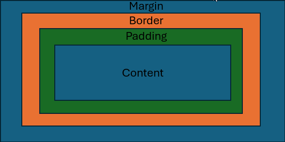
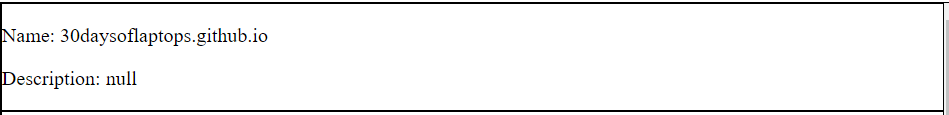
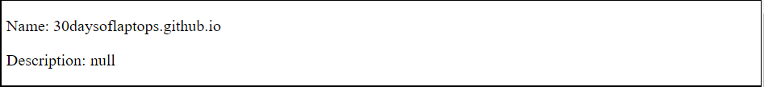

1.Explain using code examples what is meant by props and state in
React JS?

Props are data passed into a react component. Props are a part of pure functions; you can't change a component modifying its own props.
The following function shows the use of props.
The car function takes props as an argument and in this case the garage function uses the car function and sets the brand prop to ford so the result will be "Who lives in my garage" then "I am a Ford".
```
function Car(props) {
return <h2>I am a { props.brand }!</h2>;
}
function Garage() {
return (
<>
<h1>Who lives in my garage?</h1>
<Car brand="Ford" />
</>
);
}
ReactDOM.render(<Garage />, document.getElementById('root'));
```
The state is a built-in React object that is used to contain data or information about the component. A component’s state can change over time; whenever it changes, the component re-renders.
The code below uses states to hold and change the name state to have it displayed.
The state starts as having name as "World" once update name starts it changes the state name to Simplilearn so once rendering begins it will display the state name in the this not statename. So, in short states hold info in this case name and can be changed by setting the state to something new and the new info will be displayed when it’s called.  
```
class Greetings extends React.Component {
  state = {
    name: "World"
  };
  updateName() {
    this.setState({ name: "Simplilearn" });
  }
  render() {
      return(
          <div>{this.state.name}</div>
      )
  }
}
```

2.In functional programming, what does the term functor mean? Can you give
an example in JavaScript?

A functor is a data object that can hold elements of any data type and which.
implements the map operation (a function)

The JavaScript example below shows what a functor is. The code below unwarps the values apply a function to them or in this case does it twice and finally rewraps the value. So as shown below in this case the functor unwraps the values in the array applies the function to the values rewraps it into an array then the second function will do the same and will rewrap the value in the context in this case an array. 

['123', '456', '789']
.map(s => parseInt(s))
.map(n => n / 10) // => [12.3, 45.6, 78.9]

3.We have looked at three kinds of asynchronous programming mechanisms, namely callbacks, promises and streams. Mention one advantage and one disadvantage of each type.

-Callbacks-
Advantage:
It allows for code to be run while the callback is being performed. 

Disadvantage:
Further asynchronous requests require that it uses the first callbacks logic causing nested callbacks which are difficult to debug and to handle error cases.

-Promises-
Advantage:
Helps to mitigate the Christmas tree of doom with the use of .then()
Disadvantage:
Without using the catch method errors may be ignored and cause problems down the line.

-Streams-
Advantage:
Streams increase the performance, even when the memory is limited.
Disadvantage:
The Learning curve on streams is steep due to its complexity. 

4.With the aid of a diagram and example code, describe the Cascading Style Sheets (CSS) Box Model and show how it can be used to space DOM elements

The CSS Box Model is in essence a box that wraps around all html elements. Content, padding, borders and margins is what it consists of as seen in the picture below.

 


 HTML:
 ```
<!DOCTYPE HTML>
<html lang="en">
<head>    
<meta charset="UTF-8">   
<div>
<p>Name: 30daysoflaptops.github.io</p>
<p>Description: null</p>
</div>   
</body>
</html>
```
Before



```
CSS:
#repo_list p{
    margin-left: 6px;
}
```
After



As you can see from the pictures above the text is attached to the left side but when you add margin styling to the element it pushes the
element from the left out because the left side of the box is pushed out.

5.Detail how the browser loads and bootstraps a rich web application from an initial URL.

Browser:

1.User navigates to a URL in the browser and the browser goes to the DNS.

2.Browser makes TCP connection to server IP and designated port associated with that URL. The protocols tell where the files to load the website are located in the server.

3.An application server listening at that ip address accepts connection from browser.

4.Browser sends HTTP request over the open TCP connection.

5.The application server parses the request and responds to the browser over the same TCP connection, delivering the files needed.


Loading the Web App:

1.First HTTP request loads initial assets (HTML, CSS, JavaScript or Multimedia files)

2.As files are loaded browser parses each and runs commands contained therein.

3.Some commands can call back to server for more assets.

4.This goes on till all assets are collected.
